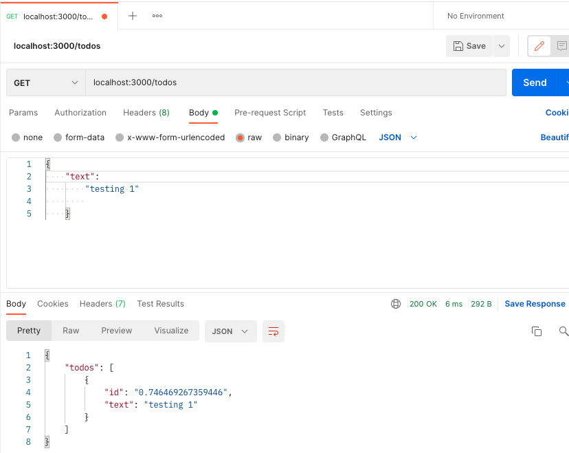

## important
this is the frontend of  <a href="https://github.com/raidel90/react-05-finished">basic-node-ts</a>

## Install

`npm install`


## compile TS

`npm run tsc`

## run

`npm start`

### comands just in case

`npm install --save-dev typescript`

### problems with TS
To do: `npm run tsc` that (at least on Mac) I had to add the path for the actual compiler within the package, like this


```js
{
"name": "foo"
 "scripts": {
 "tsc": "./node_modules/typescript/bin/tsc"
 },
  "dependencies": {
    "typescript": "^2.3.3",
    "typings": "^2.1.1"
  }
}
```


### routes

```javascript
app.use('/todos', todoRoutes);
router.post('/', createTodo);
router.get('/', getTodos);
router.patch('/:id', updateTodo);
router.delete('/:id', deleteTodo); 
```

### demo capture



